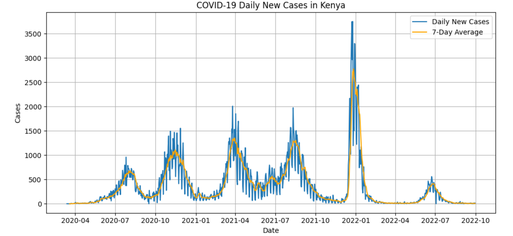
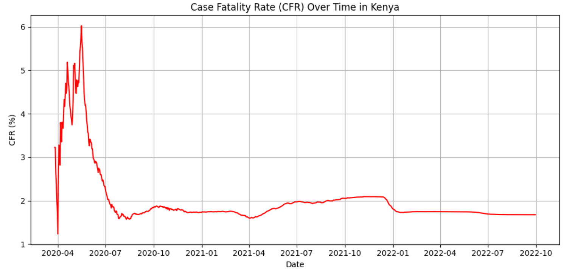
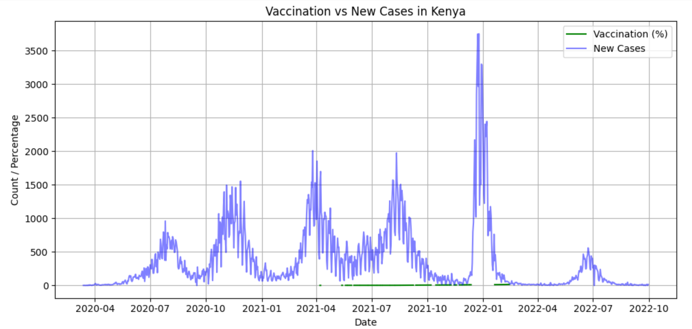

### 1. COVID-19 Evaluation

**Description:**  

Trend analysis of COVID-19 cases using open data from Our World in Data (OWID). This project includes visualization of daily new cases, 7-day moving averages, case fatality rate (CFR), and vaccination trends in Kenya.

**Folder:** `COVID19_Evaluation`

---

## Key Visualizations

### Daily New Cases with 7-day Moving Average
  
*This line chart shows the daily new COVID-19 cases in Kenya along with a 7-day moving average to smooth out short-term fluctuations and highlight overall trends.*

### Case Fatality Rate (CFR) Over Time
  
*This plot visualizes the Case Fatality Rate (CFR) over time in Kenya. It represents the proportion of deaths compared to confirmed cases, showing how the fatality risk changed throughout the pandemic.*

### Vaccination vs New Cases
  
*This graph compares vaccination coverage (percentage of population vaccinated) with new COVID-19 cases. It illustrates how increasing vaccination rates corresponded with changes in daily infections.*

---

**Future Improvements:**

- Include multiple countries for comparison.  
- Forecasting using ARIMA or Prophet.  
- Interactive dashboard using Streamlit or Flask.  

---

